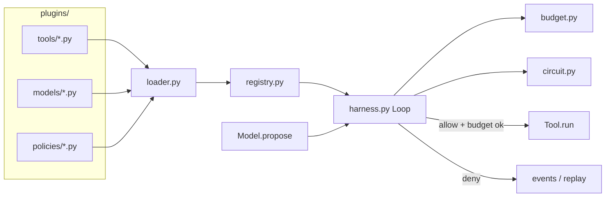

# 实战项目 · Hot-pluggable Agent Harness

主流热插拔 Harness：工具 / 模型后端 / 策略从 `plugins/` 目录加载，**不改核心循环**即可扩展。

对照课纲 A1（`curriculum/advanced/A1-runtime`）的控制面能力，本项目把「硬编码 tools/executors」升级为 **插件发现 + Protocol 契约**。

## 公式

`Model + Harness = Agent`

| 角色 | 职责 |
|------|------|
| **Model 插件** | 只提出下一步（final 或 tool_calls） |
| **Harness** | 拥有 Loop；强制 Budget / Allowlist / Circuit / Cancel / Event log |
| **Tool 插件** | 实现 `run(call, state) -> str`，丢进 `plugins/tools/` |
| **Policy 插件** | 实现 `check(state, call) -> PolicyDecision` |

## 架构



隔离键（每次 run 强制）：`tenant_id` / `user_id` / `thread_id` / `run_id`。

## 如何运行

```bash
cd projects/hotplug-harness
# 可选：pytest
pip install -r requirements.txt
python demo.py          # 末尾应出现 ALL_OK
python -m pytest -q
```

## 如何新增一个 Tool 插件（≤5 步）

1. 在 `plugins/tools/` 新建 `my_tool.py`
2. 实现带 `name` 与 `run(call, state)` 的类（或实现 `ToolPlugin` Protocol）
3. 暴露 `create_tool()` 或模块级 `PLUGIN = MyTool()`
4. **不要**改 `harness.py` / 核心循环
5. 重新 `python demo.py` 或 `load_default()` —— registry 会自动出现新工具名

示例：

```python
# plugins/tools/greet.py
from dataclasses import dataclass

@dataclass
class GreetTool:
    name: str = "greet"
    def run(self, call, state):
        return f"hi:{call.args.get('who', 'world')}"

def create_tool():
    return GreetTool()
```

Model / Policy 同理：分别放进 `plugins/models/`、`plugins/policies/`。

## 目录

```
projects/hotplug-harness/
  hotplug_harness/     # 核心：contracts / loader / registry / harness / budget / circuit
  plugins/tools/       # echo + flaky
  plugins/models/      # scripted_happy / infinite_same_tool / unique_infinite / forbidden_tool
  plugins/policies/    # allowlist
  demo.py              # a–e 场景 + ALL_OK
  tests/               # loader / circuit / budget / allowlist
  PASS.md RUN.md
```

## 与 A1 的关系

- A1：最小控制面（概念 + 故障注入），executors/tools 写在课内文件里
- 本项目：同样的控制面语义，但 **插件目录热加载**，面向作品集「可扩展 Harness」叙事

**不要修改** `curriculum/advanced/A1–A9` 或 `B1–B2`。
