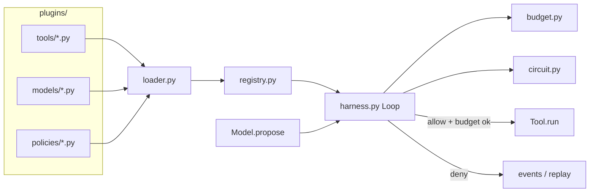

# 实战项目 · Hot-pluggable Agent Harness

主流热插拔 Harness：工具 / 模型后端 / 策略从 `plugins/` 目录加载，**不改核心循环**即可扩展。

对照课纲 A1（`curriculum/advanced/A1-runtime`）的控制面能力，本项目把「硬编码 tools/executors」升级为 **插件发现 + Protocol 契约**。

## 公式

`Model + Harness = Agent`

| 角色 | 职责 |
|------|------|
| **Model 插件** | 只提出下一步（final 或 tool_calls） |
| **Harness** | 拥有 Loop；强制 Budget / Allowlist / Circuit / Cancel / Event log |
| **Tool 插件** | 实现 `run(call, state) -> str`，丢进 `plugins/tools/` |
| **Policy 插件** | 实现 `check(state, call) -> PolicyDecision` |

## 架构



隔离键（每次 run 强制）：`tenant_id` / `user_id` / `thread_id` / `run_id`。

## 如何运行

### CLI（原有，不要丢）

```bash
cd projects/hotplug-harness
# 可选：pytest
pip install -r requirements.txt
python demo.py          # 末尾应出现 ALL_OK
python -m pytest -q
```

### 全栈 Q&A 控制台（聊天驱动 Run）

主 UX 是 **聊天 / 问答**：学生像真实助手一样提问，一次消息驱动一次 Harness Run；右侧面板展示 status、隔离键、事件时间线、工具调用次数。场景示例芯片只**填充输入框**，仍以聊天消息提交。不需要 LLM API Key。

两个终端。

**终端 1 · 后端 FastAPI（端口 8000）**

```bash
cd projects/hotplug-harness
pip install -r backend/requirements.txt
python -m uvicorn backend.app:app --reload --host 127.0.0.1 --port 8000
```

冒烟（Q&A）：

```bash
curl -s http://127.0.0.1:8000/api/health
curl -s http://127.0.0.1:8000/api/plugins
curl -s -X POST http://127.0.0.1:8000/api/chat \
  -H 'Content-Type: application/json' \
  -d '{"message":"请用一句话解释什么是 Agent Harness？"}'
```

**终端 2 · 前端 Vite + React（端口 5173）**

```bash
cd projects/hotplug-harness/frontend
npm install
npm run dev
```

浏览器打开 http://127.0.0.1:5173 。开发时 Vite 把 `/api` 代理到 8000；CORS 也放行了 localhost Vite 端口。

只验证能编译：

```bash
cd projects/hotplug-harness/frontend
npm install && npm run build
```

### 消息关键词 → 教学路径

| 关键词（消息里出现） | 模型插件 | 期望 status | 证明 |
|------|----------|-------------|------|
| （默认 / 普通问题） | `scripted_happy` | `succeeded` | echo 一次用户问题后给出含问题原文的回复 |
| `死循环` / `熔断` | `infinite_same_tool` | `circuit_open` | 相同 tool signature 连打，Harness 熔断 |
| `预算` / `超步` | `unique_infinite` | `budget_exceeded` | 每次不同 signature，Budget 停跑 |
| `越权` / `forbidden` | `forbidden_tool` | `policy_blocked` | allowlist 拦 `drop_db` |

也可显式传 `model_name` 覆盖路由；旧 `POST /api/demos/{name}` 仍可用。`POST /api/runs` 现支持可选 `message` 字段。

「重新扫描插件」= `POST /api/plugins/reload`，重新扫 `plugins/` 目录。

## 如何新增一个 Tool 插件（≤5 步）

1. 在 `plugins/tools/` 新建 `my_tool.py`
2. 实现带 `name` 与 `run(call, state)` 的类（或实现 `ToolPlugin` Protocol）
3. 暴露 `create_tool()` 或模块级 `PLUGIN = MyTool()`
4. **不要**改 `harness.py` / 核心循环
5. 重新 `python demo.py` 或 `load_default()` —— registry 会自动出现新工具名

示例：

```python
# plugins/tools/greet.py
from dataclasses import dataclass

@dataclass
class GreetTool:
    name: str = "greet"
    def run(self, call, state):
        return f"hi:{call.args.get('who', 'world')}"

def create_tool():
    return GreetTool()
```

Model / Policy 同理：分别放进 `plugins/models/`、`plugins/policies/`。

## 目录

```
projects/hotplug-harness/
  hotplug_harness/     # 核心：contracts / loader / registry / harness / budget / circuit
  plugins/tools/       # echo + flaky
  plugins/models/      # scripted_happy / infinite_same_tool / unique_infinite / forbidden_tool
  plugins/policies/    # allowlist
  demo.py              # a–e 场景 + ALL_OK
  tests/               # loader / circuit / budget / allowlist
  backend/             # FastAPI：/api/health /plugins /runs /demos
  frontend/            # Vite + React 控制台（:5173）
  PASS.md RUN.md
```

## 与 A1 的关系

- A1：最小控制面（概念 + 故障注入），executors/tools 写在课内文件里
- 本项目：同样的控制面语义，但 **插件目录热加载**，面向作品集「可扩展 Harness」叙事

**不要修改** `curriculum/advanced/A1–A9` 或 `B1–B2`。
